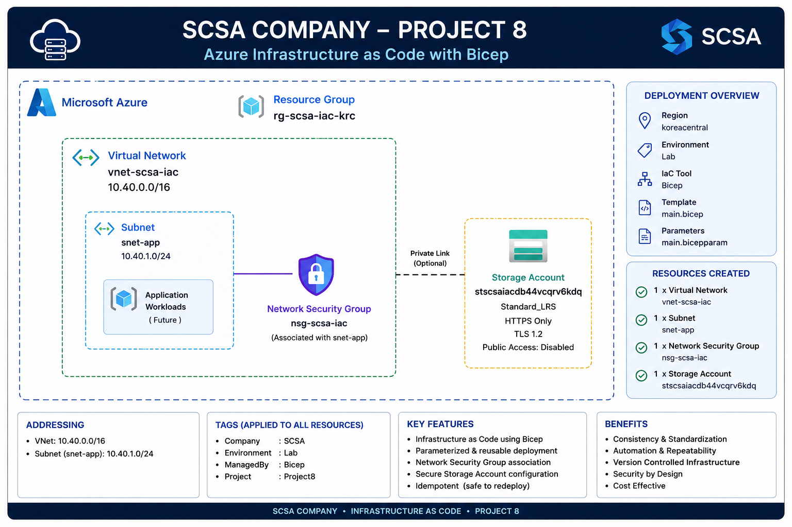

# SCSA Company – Project 8: Azure Infrastructure as Code with Bicep

## Project Overview

This project implements a reusable Azure Infrastructure as Code deployment for SCSA Company using Azure Bicep.

The objective was to move from primarily imperative Azure administration toward a declarative deployment model.

The project demonstrates:

- Azure Bicep
- Declarative Infrastructure as Code
- Parameters
- Variables
- Outputs
- Resource dependencies
- Parameter files
- Deployment validation
- Azure What-If
- Idempotent redeployment
- Network and storage provisioning
- Secure storage configuration
- Standardized resource tagging

---

## Business Scenario

SCSA Company has built its Azure environment through a series of networking, compute, storage, monitoring, backup, governance, and secure networking projects.

As the environment grows, manually creating resources through individual CLI commands becomes harder to standardize and repeat.

SCSA therefore requires a reusable deployment method that can:

- Define Azure infrastructure as code
- Standardize resource configuration
- Reduce manual deployment steps
- Reuse the same infrastructure definition with different parameters
- Validate proposed changes before deployment
- Reapply the desired configuration without creating duplicate resources

Azure Bicep was selected as the Infrastructure as Code language for this project.

---

## Architecture

The Bicep deployment provisions:

- Virtual Network
- Application subnet
- Network Security Group
- NSG-to-subnet association
- StorageV2 account
- Standardized SCSA tags

---

## Deployment Resource Group

Project 8 was deployed into:

`rg-scsa-iac-krc`

Region:

`Korea Central`

The resource group provides an isolated scope for validating the Infrastructure as Code deployment.

---

## Infrastructure as Code

Infrastructure as Code allows infrastructure configuration to be stored as code rather than manually recreated for every environment.

The project uses a declarative deployment model.

Instead of issuing individual instructions such as:

`Create NSG → Create VNet → Create Subnet → Create Storage`

the Bicep template describes the desired infrastructure state.

Azure Resource Manager then evaluates dependencies and deploys the required resources.

---

## Imperative vs Declarative Deployment

### Imperative

An imperative approach defines the sequence of actions required to create infrastructure.

Examples include individual Azure CLI commands.

The administrator specifies how each step should be performed.

### Declarative

A declarative approach defines the desired final state.

Bicep describes what resources should exist and how they should be configured.

Azure Resource Manager determines the deployment sequence based on resource references and dependencies.

---

## Bicep and Azure Resource Manager

Bicep does not replace Azure Resource Manager.

The deployment flow is:

`Bicep → Azure Resource Manager → Azure Resources`

Bicep provides a cleaner and more concise authoring experience compared with manually writing ARM JSON templates.

---

## Bicep Files

The project uses:

### Main Template

[`main.bicep`](./bicep/main.bicep)

This file defines:

- Parameters
- Variables
- Resources
- Resource relationships
- Outputs

### Parameter File

[`main.bicepparam`](./bicep/main.bicepparam)

This file supplies deployment-specific configuration values to the main template.

---

## Parameters

The Bicep template includes the following parameters:

| Parameter | Default Value |
|---|---|
| location | koreacentral |
| environment | Lab |
| vnetAddressPrefix | 10.40.0.0/16 |
| subnetAddressPrefix | 10.40.1.0/24 |
| storagePrefix | stscsaiac |

Parameters allow the same infrastructure template to be reused with different deployment values.

For example, the same Bicep template could use separate parameter files for:

- Development
- Testing
- Production

---

## Variables

The template uses variables for reusable internal configuration.

### Common Tags

The following tags are defined once and reused across resources:

| Tag | Value |
|---|---|
| Company | SCSA |
| Environment | Lab |
| ManagedBy | Bicep |
| Project | Project8 |

### Storage Account Name

The storage account name is generated using:

`uniqueString(resourceGroup().id)`

This creates a deterministic suffix based on the resource group.

The resulting deployment created:

`stscsaiacdb44vcqrv6kdq`

Because the value is deterministic for the same resource group, redeployment generates the same storage account name instead of creating a new random name.

---

## Network Security Group

The template creates:

`nsg-scsa-iac`

The NSG is deployed using the same location and standard SCSA tags as the other Project 8 resources.

The project does not create unnecessary inbound SSH or HTTP rules because no VM is deployed as part of this environment.

---

## Virtual Network

The template creates:

`vnet-scsa-iac`

Address space:

`10.40.0.0/16`

This address space was selected to avoid overlapping with earlier SCSA networks:

- `10.10.0.0/16`
- `10.20.0.0/16`

---

## Application Subnet

The VNet contains:

`snet-app`

Address prefix:

`10.40.1.0/24`

The subnet is associated with:

`nsg-scsa-iac`

The association is defined directly in the Bicep template.

---

## Resource Dependencies

The subnet configuration references:

`nsg.id`

This reference creates an implicit dependency between the VNet/subnet deployment and the Network Security Group.

Azure Resource Manager understands that the referenced NSG must exist before the subnet configuration can reference it.

This reduces the need to manually define deployment order.

---

## Storage Account

The project creates a StorageV2 account using:

`Standard_LRS`

The deployed storage account was:

`stscsaiacdb44vcqrv6kdq`

Configuration includes:

| Setting | Value |
|---|---|
| SKU | Standard_LRS |
| Kind | StorageV2 |
| HTTPS Only | Enabled |
| Minimum TLS | TLS 1.2 |
| Blob Public Access | Disabled |

The storage configuration provides a secure baseline without enabling unnecessary public Blob access.

---

## Bicep Outputs

The template returns useful deployment information through outputs.

Outputs include:

- VNet name
- Subnet ID
- NSG name
- Storage account name

The deployed values included:

| Output | Value |
|---|---|
| VNet | vnet-scsa-iac |
| Subnet | snet-app |
| NSG | nsg-scsa-iac |
| Storage Account | stscsaiacdb44vcqrv6kdq |

Outputs can be used by administrators, scripts, or other deployments.

---

## Template Compilation

The Bicep template was compiled using:

`az bicep build`

The initial template generated expected linter warnings because parameters and variables had been declared before corresponding resources were added.

After the resource definitions were completed, the template compiled without errors.

---

## Parameter File Validation

The `.bicepparam` file was validated using:

`az bicep build-params`

The parameter file successfully referenced:

`main.bicep`

and supplied the required deployment values.

---

## Deployment Validation

Before deploying the infrastructure, the template was validated at the resource-group scope.

This allowed Azure Resource Manager to check whether the template could be deployed successfully before creating resources.

---

## Azure What-If

Azure What-If was used before deployment.

What-If predicted:

- 1 Network Security Group
- 1 Virtual Network
- 1 Storage Account

The VNet configuration also included the application subnet.

The result showed:

`3 resources to create`

What-If is useful because it allows administrators to review expected infrastructure changes before committing them.

---

## Bicep Deployment

The deployment was created using:

`deploy-scsa-project8`

Deployment result:

`Succeeded`

The deployment created the expected resources in:

`rg-scsa-iac-krc`

---

## Idempotency

The same Bicep deployment was executed a second time using the same parameter file.

The second deployment also returned:

`Succeeded`

After redeployment, the resource group still contained only three top-level resources:

- `nsg-scsa-iac`
- `vnet-scsa-iac`
- `stscsaiacdb44vcqrv6kdq`

No duplicate resources were created.

This demonstrates the idempotent nature of declarative Azure deployments.

The desired infrastructure state already matched the deployed state, so Azure maintained the existing resources instead of creating additional copies.

---

## Final Validation

The final Project 8 validation confirmed:

### Subnet Security

`snet-app`

Address prefix:

`10.40.1.0/24`

Associated NSG:

`nsg-scsa-iac`

### Resource Tags

- Company: `SCSA`
- Environment: `Lab`
- ManagedBy: `Bicep`
- Project: `Project8`

### Storage Security

- HTTPS Only: `True`
- Minimum TLS: `TLS1_2`
- Blob Public Access: `False`
- SKU: `Standard_LRS`

### Deployment

`deploy-scsa-project8`

Status:

`Succeeded`

---

## Cost Management

Project 8 was intentionally designed without compute resources.

The deployment does not include:

- Virtual Machines
- Azure Firewall
- VPN Gateway
- Application Gateway
- Private Endpoints

The project primarily uses:

- VNet
- Subnet
- NSG
- StorageV2 account

This allows Infrastructure as Code concepts to be demonstrated without introducing significant Azure compute costs.

The dedicated resource group can also be removed after project validation if the infrastructure is no longer required.

---

## Troubleshooting

### Bicep Code Entered Directly into Bash

The initial Bicep parameter and variable declarations were pasted directly into the Bash terminal.

Bash attempted to interpret Bicep keywords such as:

- `param`
- `var`
- `@description`

as shell commands.

The issue was resolved by editing the `main.bicep` file directly using a text editor.

---

### Expected Unused Parameter Warnings

During early template development, Bicep generated warnings indicating that several parameters and variables were declared but unused.

These warnings were expected because the resources referencing those values had not yet been added.

After the template was completed, the warnings disappeared.

---

### Bicep BCP007 Error

Template compilation returned:

`BCP007`

The issue was caused by a stray standalone line containing:

`storageAccountName`

Bicep interpreted the line as an invalid declaration.

Removing the stray text allowed the template to compile successfully.

---

### Parameter File Path Error

An initial deployment validation failed because Azure CLI attempted to locate:

`/home/sean/main.bicepparam`

The actual file existed inside:

`~/scsa-project8`

The issue was resolved by changing back to the correct working directory before running the deployment command.

This demonstrated the importance of relative file paths when working with Bicep parameter files.

---

## Security Design

The Project 8 template includes several baseline security decisions:

- NSG associated with the application subnet
- No unnecessary inbound NSG rules
- HTTPS-only storage traffic
- TLS 1.2 minimum
- Public Blob access disabled
- No credentials in Bicep files
- No subscription identifiers stored in the template
- Standardized resource tags
- Isolated resource group
- No unnecessary compute resources

---

## Implementation

Project 8 was implemented using Azure Bicep and Azure CLI.

### Infrastructure Files

- [`main.bicep`](./bicep/main.bicep) – Defines the Azure infrastructure.
- [`main.bicepparam`](./bicep/main.bicepparam) – Defines deployment-specific parameter values.

---

## Deployment Workflow

The project followed this Infrastructure as Code workflow:

`Write Bicep`

→ `Compile`

→ `Validate Parameters`

→ `ARM Deployment Validation`

→ `What-If`

→ `Deploy`

→ `Validate Outputs`

→ `Redeploy`

→ `Verify Idempotency`

→ `Final Infrastructure Validation`

---

## Implementation Evidence

Screenshots are available in the [`screenshots`](./screenshots/) directory.

Evidence includes:

1. Successful Bicep deployment
2. Bicep deployment outputs
3. Idempotent redeployment validation
4. Final infrastructure validation

---

## Skills Demonstrated

- Infrastructure as Code
- Azure Bicep
- Azure Resource Manager
- Declarative Infrastructure
- Bicep Parameters
- Bicep Variables
- Bicep Outputs
- Bicep Resource References
- Implicit Dependencies
- Parameter Files
- Azure What-If
- Deployment Validation
- Idempotent Deployments
- Azure Virtual Networks
- Azure Subnets
- Network Security Groups
- Azure Storage
- Storage Security
- Azure Tags
- Azure CLI
- Infrastructure Automation
- Infrastructure Standardization
- Cost-Conscious Cloud Design
- IaC Troubleshooting
- Cloud Infrastructure Documentation

---

## Project Status

**Completed**

SCSA Company now has a reusable Azure Infrastructure as Code deployment using Bicep.

The final project demonstrates how Azure networking, security, storage, tagging, parameterization, validation, and deployment automation can be expressed in a declarative template.

This project completes the SCSA Azure portfolio by progressing from manual Azure administration into repeatable and standardized Infrastructure as Code.
